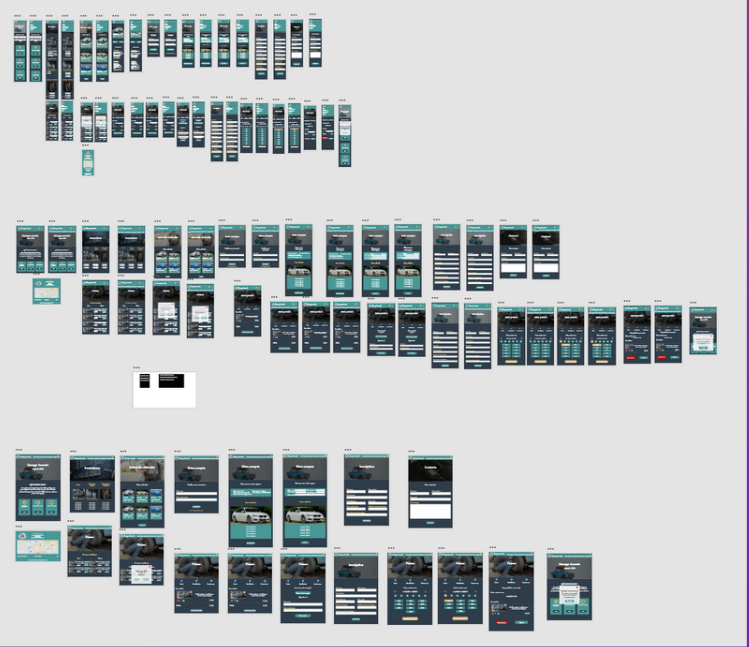

# Garage Jovanic 

As part of my training as a web developer, I had for mission to realize, with the help of 4 collaborators a complete web application with the technologies of my choice 

## Meet the team

[@MarthL](https://github.com/MarthL) <br>
[@Enzo](https://github.com/enzoran1) <br>
[@Emilie](https://github.com/Rouyem) <br>
[@Alex](https://github.com/Alexandre12021982) <br>

### Prerequisites

The things you need before installing the software.

* Any kind of suite like Wampp, Xampp, Lampp, permit you to launch and see the project 

## Features

```
$ MVC architectur
$ Php/MySQL
$ HTML/CSS with responsive from scratch (no library as bootstrap) 
```

### Server

This project isn't actually online, you can only see this project using localhost.

### Branches

* Master: We just merge all our progress in master branch
* Members (Enzo, Alex, Emilie, Martin) : Each contributor of this project had his own branch. We also provided some help for issues between us. Each contributors worked on a specific feature each week. We validate all the merge request after meeting each weeks.

### Part 1. Database Vizualisation

We designed a full database scheme with Loop in purpose of predicting all features of our web application. This database also need a lot of relations, that's why we used SQL for this project. We also need to understand all the features to predict the administrator access for the staff of the garage. 
<br><br>


### Part 2. Prototype Design

In order to have the entire graphic charter validated by the client, we have issued a complete layout before development, developed through the AdobeXD software with a prototyping system allowing it to interact as if it were on the original site so that it fully validates all the work done to date.
<br><br>


### Part 3. Development 

We were 4 developers for this project. Each weeks, we organized a meeting where we discuss about all the progress we made. We also used Trello to memorize all ideas. We finished after 2 months this project entierly. We also secured this project with administration interface that allows super-admin to add new ads, sales with CRUD administration tool. 
